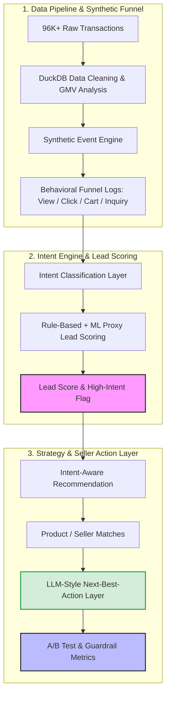

# AI-Powered Lead Generation & Recommendation Analytics Platform


> **TL;DR:** Engineered an end-to-end AI-assisted lead generation and recommendation platform on **96K+ Olist e-commerce transactions**. By designing a synthetic behavioral funnel, an intent-aware recommendation engine, and an **LLM-enhanced Seller Action Layer**, the simulated A/B test delivered a **+44.9% lift in Revenue per User (ARPU)** and a **+31.4% lift in Purchase Rate** over popularity-based baselines.

[📄 Read the Full Project Report](report/project_report.md) | [📊 View Tableau Dashboards](dashboard/tableau_links.md) | [💻 Browse Notebooks](notebook/) | [📘 Data Dictionary](report/data_dictionary.md)

---

## 💡 The Business Problem & Solution

**The Pain Point:** SMB (Small & Medium Business) sellers may have traffic, orders, customer reviews, and product visitors, but they often lack the analytics resources to know *which visitor is a high-intent lead* and *what specific follow-up action to take next*.

**The Solution:** This project moves from a simple popularity-based recommendation baseline to a complete **Lead-to-Action Workflow** that connects customer behaviour, intent mining, recommendation strategy, seller actions, and business outcome evaluation.

### 🏗️ System Architecture & Workflow

Instead of only predicting scores, this workflow translates raw marketplace data into seller-facing growth actions.



---

## 🏆 Key Commercial Results

### 1. Full-Funnel A/B Test Uplift

The intent-aware recommendation strategy outperformed the popularity baseline across the simulated funnel, especially in deeper-funnel metrics.

| Metric | Control (Popularity) | Treatment (Intent-Aware) | Incremental Lift | Significance |
|---|---:|---:|---:|---|
| **Click-Through Rate (CTR)** | 19.42% | 22.76% | **+17.2%** | ✅ p < 0.05 |
| **Inquiry Rate** | 12.70% | 16.32% | **+28.5%** | ✅ p < 0.05 |
| **Purchase Rate** | 10.32% | 13.56% | **+31.4%** | ✅ p < 0.05 |
| **Revenue per User (ARPU)** | 9.10 | 13.18 | **+44.9%** | ✅ p < 0.05 |

### 2. LLM-Enhanced Seller Action Output

Raw scores are not enough for SMB sellers. The project adds an **LLM-style Next-Best-Action Layer** that generated **15,000 seller-facing follow-up recommendations**. Instead of showing a seller only “this user scored 92”, the system turns lead and intent signals into context-aware actions.

- 🎯 *User is ready to purchase* → **Action:** `send_limited_time_offer` (**49.86%** of actions)
- 🚚 *User has delivery concerns* → **Action:** `highlight_delivery_reliability` (**19.94%** of actions)
- 💰 *User is price sensitive* → **Action:** `send_discount_or_bundle` (**18.72%** of actions)

---

## 👥 User Persona and User Journey

### Primary User: SMB Seller

A small or medium-sized seller who wants to convert marketplace traffic or livestream-style engagement into leads, inquiries, and purchases.

**Pain points:**

- limited analytics resources;
- difficulty identifying high-intent users;
- uncertainty about what product, offer, or message to use;
- need for simple next-best-action guidance instead of complex model outputs.

### Internal User: Marketplace Product / Growth Team

The internal product or growth team monitors platform-level funnel conversion, evaluates recommendation strategy performance, manages seller exposure fairness, and tracks long-term ecosystem health.

### End User: Buyer

The buyer receives more relevant product recommendations and seller follow-up actions based on their intent, concerns, and purchase readiness.

### User Journey Close-Loop

`Buyer Interaction` → `Signal Capture` → `Intent Classification` → `Lead Scoring` → `Intent-Aware Recommendation` → `Seller Action Suggestions` → `A/B Test Evaluation`

---

## 🎯 Alignment with SMB Lead Generation Scenario

| Scenario Requirement | Project Implementation |
|---|---|
| **Lead Generation & Mining** | Built a synthetic behavioural funnel: View → Click → Cart → Inquiry → Purchase |
| **Recommendation Strategy** | Designed and compared popularity-based, category-preference, and intent-aware ranking strategies |
| **LLM Application** | Added an LLM-style seller action layer that turns lead and intent signals into seller-facing recommendations |
| **Data-Driven Decisions** | Implemented controlled A/B test evaluation using significance testing |
| **Seller Growth Thinking** | Converted raw model outputs into actions such as discounts, delivery reassurance, social proof, and customer support |
| **Marketplace Guardrails** | Considered seller reliability, delivery quality, product diversity, and long-term platform health |

---

## 📂 Project Workflow (Notebooks 01–08)

### [01. Data Understanding and Cleaning](notebook/01_data_understanding_and_cleaning.ipynb)

Merges fragmented Olist relational tables into an order-level analytical base. Engineered features include GMV, delivery delay, price band, review sentiment, category, seller, and user-level signals.

**Output:** `data/processed/clean_order_base.csv`

### [02. SQL Business Analysis](notebook/02_sql_business_analysis.ipynb)

Uses DuckDB SQL for marketplace health diagnosis, including category performance, seller performance, payment behaviour, delivery delay impact, and review quality.

**Output:** SQL KPI tables such as `category_performance.csv`, `top_sellers_by_gmv.csv`, and `delivery_delay_impact.csv`

### [03. Synthetic User Funnel Analysis](notebook/03_user_funnel_analysis.ipynb)

Constructs synthetic front-end engagement events using transparent probability rules conditioned on user segment, traffic source, device type, category, price band, review score, and operational signals.

**Output:** `data/final/fact_user_events.csv`

### [04. Intent Classification Layer](notebook/04_llm_intent_classification.ipynb)

Builds an inspectable intent classification layer across major user intent categories, including `ready_to_purchase`, `price_sensitive`, `delivery_concern`, `product_quality_concern`, `after_sales_issue`, `general_negative`, and `neutral_or_unclear`.

**Output:** `data/final/fact_reviews_llm.csv`

### [05. Lead Scoring Model](notebook/05_lead_scoring_model.ipynb)

Creates a lead scoring framework and trains proxy machine learning models to validate rule consistency and identify important lead-quality drivers.

**Output:** `data/final/fact_lead_scores.csv` and lead scoring model result tables

### [06. Recommendation Strategy](notebook/06_recommendation_strategy.ipynb)

Builds the core recommendation engine and compares three strategies: popularity-based recommendation, category-preference recommendation, and intent-aware recommendation.

**Output:** `data/final/fact_recommendations.csv`

### [07. Simulated A/B Test Evaluation](notebook/07_ab_test_evaluation.ipynb)

Evaluates control vs. treatment performance using full-funnel experiment metrics and statistical testing.

**Output:** `data/final/fact_recommendation_experiment.csv` and A/B test summary tables

### [08. LLM Intent Explanation & Seller Action Layer](notebook/08_llm_intent_explanation.ipynb)

Turns structural metadata, intent buckets, lead scores, recommendation candidates, and seller quality constraints into natural-language seller action explanations and next-best-action recommendations.

**Output:** `outputs/tables/llm_seller_action_recommendations.csv`

---

## 📊 Tableau Dashboards

The analytical outputs are visualised through three Tableau dashboards:

1. **Dashboard 1: Executive Overview**  
   Shows marketplace health KPIs, monthly GMV trends, category performance, and high-level A/B test results.

2. **Dashboard 2: User Intent & Lead Quality**  
   Breaks down intent distributions, lead score patterns, user segments, and high-intent customer concentration.

3. **Dashboard 3: Recommendation A/B Test Performance**  
   Compares funnel conversions, purchase-rate lift, revenue-per-user lift, and strategy-level performance.

Dashboard screenshots are stored in `dashboard/tableau_screenshots/`. Tableau Public links are available in `dashboard/tableau_links.md`.

---

## 🛣️ Product Roadmap & MVP Plan

```text
[MVP 0: Analytics Core]
        ↓
[MVP 1: Lead Generation Engine]
        ↓
[MVP 2: Recommendation Strategy]
        ↓
[MVP 3: LLM Seller Actions]
        ↓
[MVP 4: Experimentation & Reporting]
```

| Stage | Focus | Main Outputs |
|---|---|---|
| **MVP 0** | Analytics foundation | Clean order table, SQL KPI outputs, Tableau overview |
| **MVP 1** | Lead generation engine | Synthetic funnel, intent categories, lead scores |
| **MVP 2** | Recommendation strategy | Popularity-based, category-preference, and intent-aware recommendations |
| **MVP 3** | LLM-style seller action assistant | Seller action type, priority, message, explanation |
| **MVP 4** | Experimentation and stakeholder reporting | Simulated A/B test, uplift metrics, Tableau dashboards |
| **Production extension** | Real platform deployment | Real clickstream logs, real LLM scripts, CRM integration, online A/B testing, safety guardrails |

---

## 🛠️ Project Structure

```text
AI-lead-generation-recommendation-analytics/
│
├── data/
│   ├── raw/                         # Original Olist datasets
│   ├── processed/                   # Cleaned order-level base table
│   └── final/                       # Final funnel, intent, recommendation, and experiment tables
│
├── notebook/
│   ├── 01_data_understanding_and_cleaning.ipynb
│   ├── 02_sql_business_analysis.ipynb
│   ├── 03_user_funnel_analysis.ipynb
│   ├── 04_llm_intent_classification.ipynb
│   ├── 05_lead_scoring_model.ipynb
│   ├── 06_recommendation_strategy.ipynb
│   ├── 07_ab_test_evaluation.ipynb
│   └── 08_llm_intent_explanation.ipynb
│
├── src/
│   ├── data_pipeline.py             # Data cleaning and synthetic funnel generation
│   ├── intent_engine.py             # Intent feature extraction and lead scoring support
│   ├── recommendation_strategy.py   # Recommendation strategy logic
│   └── utils.py                     # Shared utility functions
│
├── outputs/
│   ├── tables/                      # Business summaries, A/B test outputs, and seller action tables
│   └── model_results/               # Lead scoring model metrics and feature importance
│
├── dashboard/
│   ├── tableau_screenshots/         # Tableau dashboard screenshots
│   └── tableau_links.md             # Tableau Public dashboard links
│
├── report/
│   ├── executive_summary.md
│   ├── project_report.md
│   └── data_dictionary.md
│
├── sql/
│   └── business_kpi_queries.sql
│
├── main.py
├── README.md
├── requirements.txt
└── .gitignore
```

---

## ⚙️ How to Run This Project

1. Clone the repository:

```bash
git clone https://github.com/Raina-Hong/AI-lead-generation-recommendation-analytics.git
cd AI-lead-generation-recommendation-analytics
```

2. Install requirements:

```bash
pip install -r requirements.txt
```

3. Download the raw public Olist dataset from [Kaggle](https://www.kaggle.com/datasets/olistbr/brazilian-ecommerce) and place all CSV files into `data/raw/`.

4. Run the notebooks in order from `01` to `08`.

---

## 📚 Documentation

- [Full Project Report](report/project_report.md)
- [Executive Summary](report/executive_summary.md)
- [Data Dictionary](report/data_dictionary.md)
- [Tableau Dashboard Links](dashboard/tableau_links.md)

---

## 🚧 Production Considerations

This project is a portfolio prototype, not a production recommendation system. A production version would require:

- real impression, click, inquiry, chat, livestream engagement, and non-purchase session logs;
- online A/B testing with live randomisation;
- real-time or near-real-time feature pipelines;
- recommendation diversity and seller fairness controls;
- LLM governance for privacy, hallucination control, content safety, and auditability;
- seller action guardrails to avoid aggressive promotion for negative or support-related users;
- long-term metrics such as retention, complaint rate, refund rate, and seller satisfaction.

---

## ✒️ Author

**Raina Hong**  
Master of Computer Science, The University of Sydney  
Focus: Data Science, Recommendation Strategy, LLM Applications, and AI Product Analytics
