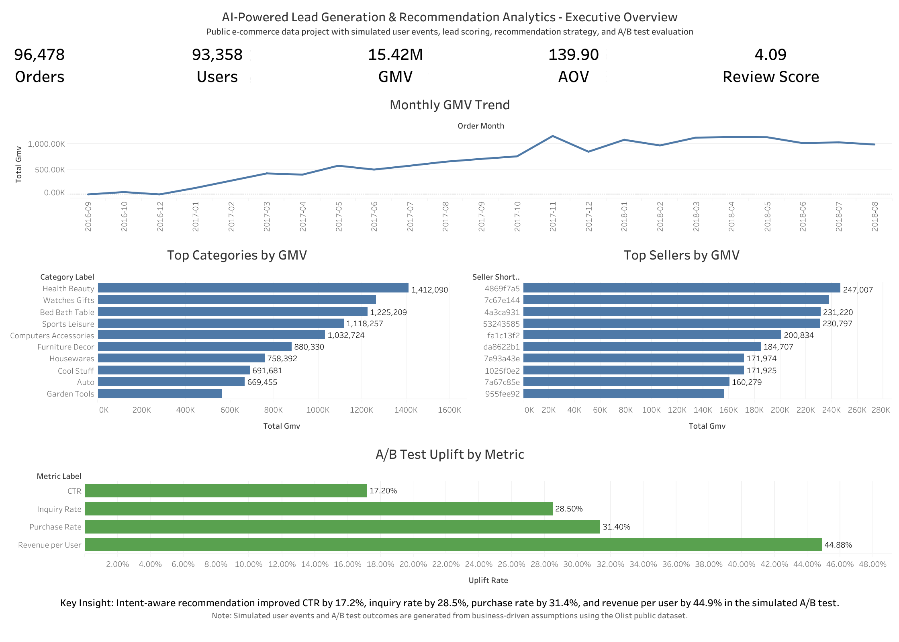
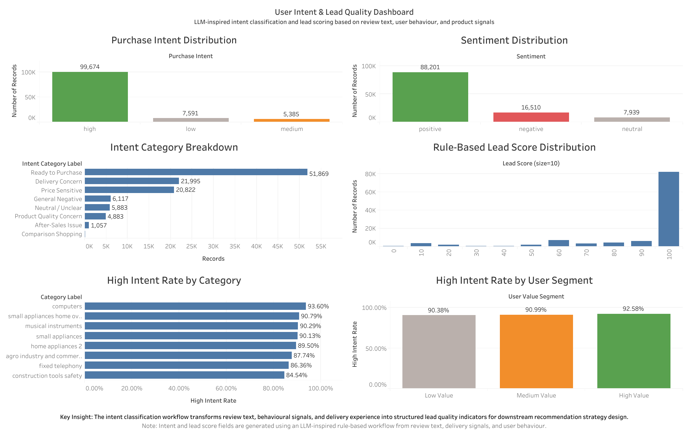
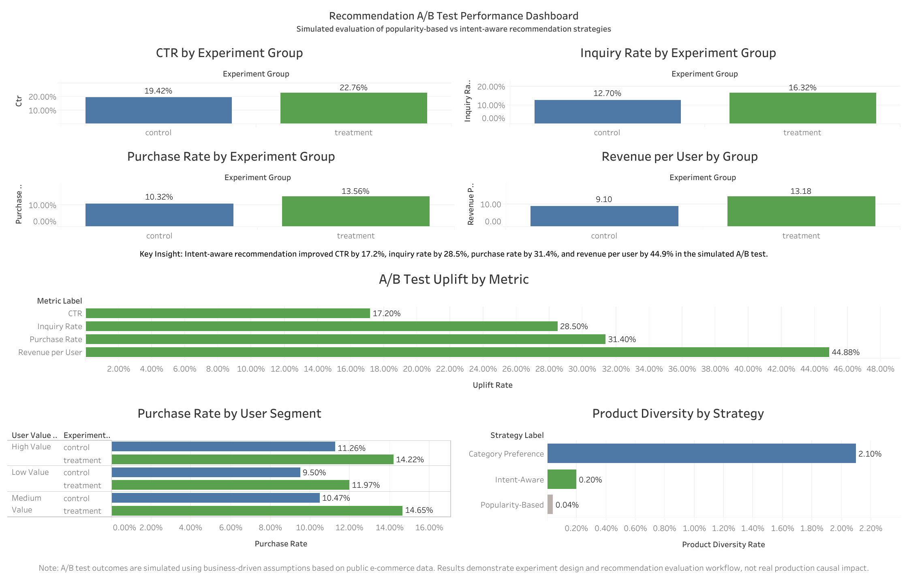

# AI-Powered Lead Generation & Recommendation Analytics Report

[🔙 Back to Project Repository](../README.md) | [📊 View Tableau Dashboards](../dashboard/tableau_links.md) | [📂 Browse Notebooks](../notebook/) | [📘 Data Dictionary](data_dictionary.md)

## Table of Contents

- [1. Introduction](#1-introduction)
- [2. Product Problem Framing, User Persona and Journey](#2-product-problem-framing-user-persona-and-journey)
- [3. Data Sources and Analytical Tables](#3-data-sources-and-analytical-tables)
- [4. Data Cleaning and Feature Engineering](#4-data-cleaning-and-feature-engineering)
- [5. SQL Business Analysis](#5-sql-business-analysis)
- [6. Synthetic User Funnel Construction](#6-synthetic-user-funnel-construction)
- [7. Intent Classification Layer](#7-intent-classification-layer)
- [8. Lead Score Automation and Feature Importance Analysis](#8-lead-score-automation-and-feature-importance-analysis)
- [9. Recommendation Strategy Design](#9-recommendation-strategy-design)
- [10. LLM-Enhanced Seller Action Layer](#10-llm-enhanced-seller-action-layer)
- [11. Simulated AB Test Evaluation](#11-simulated-ab-test-evaluation)
- [12. Tableau Dashboard Analysis](#12-tableau-dashboard-analysis)
- [13. Key Findings and Business Recommendations](#13-key-findings-and-business-recommendations)
- [14. Product Roadmap and MVP Plan](#14-product-roadmap-and-mvp-plan)
- [15. Production Considerations and Limitations](#15-production-considerations-and-limitations)
- [16. Future Improvements](#16-future-improvements)
- [17. Conclusion](#17-conclusion)

## 1. Introduction

> **TL;DR:** Engineered a synthetic funnel on 96K+ Olist transactions, designed an intent-aware recommendation system, and added an LLM-style seller action layer to translate lead scores into practical next-best actions. Evaluated via a simulated A/B test, the strategy drove a **+44.9% lift in ARPU** and **+31.4% in purchase rate** over popularity-based baselines.

In this project, I architected an end-to-end analytics workflow for e-commerce lead generation, customer intent analysis, recommendation strategy design, and experiment evaluation.

The starting point was the public Olist Brazilian e-commerce dataset. It gives a solid transaction foundation: orders, customers, sellers, products, payments, reviews, and delivery information. What it does not provide is the front-end behavioural layer that a real marketplace would normally collect, such as product views, clicks, add-to-cart events, inquiries, or abandoned sessions.

That gap shaped the project design. Rather than treating the missing behavioural logs as a blocker, I built a **business-driven synthetic event pipeline** on top of the real transaction data. The pipeline uses transparent probability rules and commercial assumptions to reconstruct a plausible engagement journey around confirmed orders. In practice, this turns a static transaction dataset into a more realistic product analytics environment.

The workflow is designed around four business questions:

- How is the marketplace performing across users, categories, sellers, and delivery quality?
- Which users show stronger intent and should be prioritised as leads?
- Can a recommendation strategy use intent, review quality, and seller reliability instead of relying only on popularity?
- Does the intent-aware strategy produce measurable incremental lift in the experiment framework?

The final output is not just a notebook exercise. It includes cleaned analytical tables, SQL-based KPI analysis, a synthetic funnel, an explainable intent layer, lead score automation, recommendation strategy evaluation, an LLM-style seller action layer, A/B test analysis, and Tableau dashboards for stakeholder communication.

> **Key takeaway:** I used a real transaction dataset to build the kind of analytical layer a marketplace would need before scaling lead generation and recommendation decisions.

## 2. Product Problem Framing, User Persona and Journey

### 2.1 Product Problem Framing

This project is framed as a product analytics problem for a marketplace platform serving small and medium-sized sellers.

The problem is not simply how to recommend products. In a lead generation scenario, SMB sellers need to know which users are worth following up with, why those users may convert, what product or seller should be recommended, and what action should be taken next.

From the platform side, the challenge is also broader than ranking. The platform needs to connect transaction data, review signals, delivery quality, user engagement, recommendation logic, and experiment evaluation into one workflow.

The product problem can be defined as:

> How can a marketplace platform help SMB sellers turn fragmented user, order, review, delivery, and engagement signals into high-intent lead prioritisation, relevant recommendations, and actionable seller follow-up decisions?

This framing shaped the project design. Instead of building only one recommendation model, I built an end-to-end workflow:

`Data cleaning → SQL business analysis → Synthetic funnel → Intent classification → Lead scoring → Recommendation strategy → LLM-style seller action → A/B test evaluation`

The project answers four business questions:

1. **Lead generation:** How can high-intent users be identified from review, delivery, transaction, and behavioural signals?
2. **Recommendation strategy:** Can product recommendation be improved by combining user intent, product quality, seller reliability, and category preference?
3. **Seller action support:** How can lead scores and intent labels be translated into seller-facing next-best actions?
4. **Experiment evaluation:** Under a controlled simulated experiment, does an intent-aware recommendation strategy outperform a popularity-based baseline?

A basic popularity-based recommendation strategy is easy to implement, but it ignores several important signals:

- whether the user is showing strong purchase intent;
- whether the product matches the user's preferred category;
- whether the product has good review quality;
- whether the seller delivers reliably;
- whether the user belongs to a higher-value customer segment;
- whether the seller knows what action to take next;
- whether the strategy improves downstream conversion and revenue metrics.

This is why the project combines recommendation analytics with lead scoring, seller action guidance, and simulated experiment evaluation.

### 2.2 User Persona

The product serves three types of users.

#### Persona 1: SMB Seller

The primary user is a small or medium-sized seller on a marketplace platform.

This seller may have traffic, orders, customer reviews, and product visitors, but may not have a dedicated analytics or growth team. Their pain points are practical:

- they do not know which users are worth following up with;
- they do not have time to manually analyse user behaviour or review text;
- they need to understand whether a user is price-sensitive, delivery-concerned, quality-concerned, or ready to purchase;
- they need simple follow-up guidance rather than raw model scores;
- they care about turning visitors, inquiries, and high-intent users into actual purchases.

For this persona, the product should not only show a lead score. It should provide a clear next step, such as sending a limited-time offer, highlighting delivery reliability, offering a discount bundle, showing social proof, or providing customer support.

This is why the final LLM-style seller action layer outputs seller-facing fields such as `seller_action_type`, `seller_action_priority`, `seller_action_message`, and `llm_style_explanation`.

#### Persona 2: Marketplace Product / Growth Team

The second user is the internal marketplace product or growth team.

This team needs to design and evaluate lead generation strategies at platform level. Their questions are different from the seller's questions:

- which user segments show stronger purchase intent?
- which categories or sellers perform better?
- does the intent-aware recommendation strategy outperform a popularity-based baseline?
- which seller actions are most common?
- does the strategy improve CTR, inquiry rate, purchase rate, and revenue per user?
- does the system create risks such as low product diversity, seller concentration, or delivery complaints?

For this persona, the project provides SQL KPI outputs, funnel analysis, recommendation strategy comparison, A/B test summaries, and Tableau dashboards.

#### Persona 3: End Buyer

The end buyer is the customer who interacts with marketplace recommendations, seller messages, and product offers.

For buyers, the goal is not to maximise seller outreach at all costs. The system should make recommendations and follow-up actions more relevant to their needs. For example:

- price-sensitive users should receive value-focused offers;
- delivery-concerned users should see delivery reassurance;
- product-quality-concerned users should see reviews or social proof;
- after-sales users should receive support rather than aggressive promotion.

This helps connect seller growth with a better buyer experience.

### 2.3 User Journey

The product journey can be described as a lead-to-action workflow.

1. **Buyer interaction:** A buyer views, clicks, adds to cart, inquires about, or purchases products on the marketplace. Since the public Olist dataset does not include real clickstream logs, this project creates a synthetic event funnel to simulate these behavioural signals.

2. **Signal capture:** The platform combines transaction data, product category, seller information, review score, review text, delivery delay, traffic source, device type, and synthetic engagement events.

3. **Intent understanding:** The intent layer classifies users into categories such as `ready_to_purchase`, `price_sensitive`, `delivery_concern`, `product_quality_concern`, `after_sales_issue`, `general_negative`, or `neutral_or_unclear`.

4. **Lead prioritisation:** The lead scoring layer converts behavioural, transaction, review, and delivery signals into lead scores and high-intent flags. This helps identify which users should receive more attention.

5. **Recommendation generation:** The recommendation layer creates product and seller candidates using popularity-based, category-preference, and intent-aware strategies.

6. **Seller action support:** The LLM-style seller action layer translates lead score, intent category, recommendation output, and seller quality signals into practical next-best actions for sellers.

7. **Experiment evaluation:** The A/B test layer compares the treatment strategy against the control strategy using CTR, inquiry rate, purchase rate, revenue per user, and statistical significance testing.

This journey connects user behaviour, AI-driven interpretation, recommendation strategy, seller action, and business outcome evaluation in one project workflow.

---

## 3. Data Sources and Analytical Tables

I used the Olist public e-commerce dataset as the raw data source. The dataset includes customer profiles, order lifecycle records, order items, payments, product information, seller information, category translations, reviews, and geolocation data.

The raw files were not analysed in isolation. I transformed them into a set of business-ready analytical tables, each designed for a specific part of the workflow:

| Dataset | Role in the Project |
|---|---|
| `clean_order_base.csv` | Cleaned order-level table used for KPI analysis, delivery analysis, category analysis, and customer value segmentation |
| `fact_user_events.csv` | Synthetic user event table used for funnel analysis |
| `fact_reviews_llm.csv` | Intent classification and rule-based lead score table |
| `fact_lead_scores.csv` | Lead score automation and model output table |
| `fact_recommendations.csv` | Recommendation candidates generated from different recommendation strategies |
| `fact_recommendation_experiment.csv` | Simulated experiment table for control and treatment group analysis |

This structure keeps the project modular. The order base supports commercial reporting, the event table supports funnel analysis, the intent table supports lead prioritisation, and the experiment table supports A/B test evaluation.

> **Key takeaway:** the data layer was organised like a small analytics mart rather than a collection of disconnected CSV files.

## 4. Data Cleaning and Feature Engineering

The project needed a clean order-level table before any useful business analysis could happen. I merged order records with customer, product, seller, payment, review, item-level, and category translation data to create a single analytical base.

The main cleaning and feature engineering work included:

- filtering and preparing delivered order records;
- translating product category names into English;
- calculating GMV from product price and freight value;
- calculating delivery delay from actual and estimated delivery dates;
- creating a late delivery flag;
- extracting order year and order month;
- standardising category labels;
- creating price bands;
- preserving customer location, seller location, payment type, and review score for downstream analysis.

The final order base contains the following business-ready fields:

- `gmv`
- `delivery_delay_days`
- `late_delivery_flag`
- `price_band`
- `category`
- `payment_type`
- `review_score`
- `seller_state`
- `customer_state`

I also checked missing values before using the data for modelling and dashboards. Missing values were not treated mechanically. For example, missing review text was acceptable because review score still provided a usable satisfaction signal, while missing delivery timestamps had to be handled carefully because delivery delay directly affected the fulfilment analysis.

This step matters because every later result depends on this table. Bad joins or inconsistent date logic would flow directly into the funnel, intent scoring, recommendations, and A/B test results.

> **Key takeaway:** the cleaning stage turned raw marketplace records into a reliable analytical foundation for both business reporting and downstream scoring logic.

## 5. SQL Business Analysis

I used DuckDB for the SQL layer because it is well suited to portfolio-scale analytics: it supports fast in-memory analytical queries directly on local files, without the setup overhead of a traditional database. This made it a practical choice for producing repeatable KPI tables while keeping the project lightweight and easy to run.

The SQL layer produced outputs for overall marketplace performance, monthly GMV trend, category performance, seller performance, payment method, review quality, customer value, and delivery delay impact.

The overall marketplace summary shows a large and commercially meaningful transaction base:

| Metric | Value |
|---|---:|
| Completed orders | **96,478** |
| Unique users | **93,358** |
| Unique products | **32,216** |
| Unique sellers | **2,970** |
| Total GMV | **BRL 15.42M** |
| Average order value | **BRL 139.93** |
| Average review score | **4.09** |

The highest-GMV product categories were:

| Category | Orders | Total GMV | Average Review Score |
|---|---:|---:|---:|
| health_beauty | 8,647 | **BRL 1.41M** | 4.20 |
| watches_gifts | 5,495 | **BRL 1.26M** | 4.08 |
| bed_bath_table | 9,272 | **BRL 1.23M** | 3.94 |
| sports_leisure | 7,530 | **BRL 1.12M** | 4.17 |
| computers_accessories | 6,530 | **BRL 1.03M** | 3.99 |

Payment analysis showed that credit card was the dominant payment method, with **73,941 orders** and **BRL 12.23M GMV**. Boleto was the second-largest payment method, with **19,191 orders** and **BRL 2.77M GMV**.

The clearest operational signal came from delivery performance:

| Delivery Group | Orders | Avg Delivery Delay Days | Avg Review Score | Negative Review Rate |
|---|---:|---:|---:|---:|
| Non-late delivery | 89,936 | -13.62 | **4.21** | **11.32%** |
| Late delivery | 6,534 | 10.49 | **2.33** | **61.32%** |

This result changes how recommendation quality should be judged. A seller with strong sales volume but poor fulfilment quality should not be ranked the same way as a seller with both strong demand and reliable delivery.

**Business implication:** seller delivery performance should be used as a penalty factor in recommendation ranking, especially for high-intent users who are close to conversion.

> **Key takeaway:** delivery reliability is not a back-office metric. It is a conversion and trust signal.

## 6. Synthetic User Funnel Construction

Lead generation analysis needs a behavioural journey, but the Olist dataset only provides confirmed transactions. I handled that gap by designing a **business-driven synthetic event pipeline** on top of the real order data.

The goal was practical: recreate the type of engagement layer a marketplace would normally track before conversion. Instead of stopping at completed purchases, the workflow reconstructs the following engagement journey:

`view` → `click` → `add_to_cart` → `inquiry` → `purchase`

This format makes the funnel logic easier to read and avoids ambiguity in the event sequence.

<b>Expand: Synthetic funnel design assumptions</b>

The synthetic funnel includes five stages:

- `view`
- `click`
- `add_to_cart`
- `inquiry`
- `purchase`

The original public dataset does not contain front-end event logs. To make the project analytically useful for lead generation and recommendation testing, I generated behavioural events using reproducible probability rules.

The rules consider business factors such as:

- user value segment;
- review score and sentiment;
- traffic source;
- device type;
- purchase behaviour;
- price and GMV band.

Higher-value users and users with stronger purchase signals were assigned higher probabilities of moving into deeper funnel stages. The output is not treated as real clickstream data. It is a structured business logic engine that turns transaction records into a usable product analytics prototype.

The generated funnel summary was:

| Event Type | Unique Users | Conversion from View | Stage-to-Stage Conversion |
|---|---:|---:|---:|
| view | **93,358** | 100.00% | 100.00% |
| click | **65,258** | 69.90% | 69.90% |
| add_to_cart | **48,823** | 52.30% | 74.82% |
| inquiry | **35,024** | 37.52% | 71.74% |
| purchase | **93,358** | 100.00% | 266.55% |

The purchase stage behaves differently from a normal acquisition funnel because the dataset is transaction-based. Completed purchases already exist in the raw data, while earlier behavioural events are reconstructed around those orders. I therefore read the funnel as an engagement reconstruction around observed purchases, not as a live acquisition funnel containing both converted and non-converted visitors.

The segmentation pattern is still useful. **High Value users had a 75.16% click-through rate and a 42.07% inquiry rate**, while Low Value users had a **65.92% click-through rate and a 34.01% inquiry rate**.

That gap matters. High-value users do not just spend more; they also engage deeper.

**Business implication:** lead follow-up and recommendation targeting should be segmented by value, intent, and behaviour depth. A single funnel count is not enough.

> **Key takeaway:** high-value users show stronger engagement depth, so lead prioritisation should combine historical value with current intent signals.
## 7. Intent Classification Layer

With the synthetic funnel established, the next question became more important: which users actually look valuable from a lead generation perspective?

I answered that by engineering a transparent, rule-based intent layer inspired by how an LLM might reason over review text, delivery experience, and behavioural signals. I chose this approach instead of a black-box API because the logic needed to be inspectable. In a business setting, stakeholders should be able to understand why a user is labelled as ready to purchase, delivery-concerned, price-sensitive, or lower intent.

The intent classification layer uses:

- review score;
- review text;
- delivery delay;
- late delivery flag;
- synthetic behavioural signals;
- user value segment;
- price band;
- GMV.

Each record was assigned:

- `sentiment`: positive, neutral, or negative;
- `intent_category`: business-readable intent segment;
- `purchase_intent`: low, medium, or high;
- `lead_score`: rule-based score from 0 to 100;
- `high_intent_flag`: binary high-intent label.

<b>Expand: Intent classification rule examples</b>

The intent layer combines structured variables and review signals into business-readable categories.

Example rule logic:

- Users with positive review signals, completed purchase behaviour, and strong engagement signals are classified as `ready_to_purchase`.
- Users with late delivery, delivery-related complaints, or low review scores linked to fulfilment issues are classified as `delivery_concern`.
- Users with purchase behaviour but stronger sensitivity to price, freight, or value are classified as `price_sensitive`.
- Users with negative text signals related to product defects or quality concerns are classified as `product_quality_concern`.
- Users with weak behavioural signals and unclear review patterns are classified as `neutral_or_unclear`.

The purpose of this layer is not to replace a production LLM. It creates an explainable baseline that can later be upgraded with real text classification, embedding models, or LLM-based review interpretation.

The intent category summary showed:

| Intent Category | Records | Unique Users | Avg Lead Score | High-Intent Rate | Total GMV |
|---|---:|---:|---:|---:|---:|
| ready_to_purchase | **51,869** | 44,842 | **99.93** | **100.00%** | BRL 4.02M |
| price_sensitive | **20,822** | 19,145 | **92.48** | **92.59%** | **BRL 6.69M** |
| delivery_concern | **21,995** | 19,155 | 80.48 | 79.90% | BRL 3.36M |
| product_quality_concern | 4,883 | 4,082 | 74.79 | 78.07% | BRL 667.26K |
| neutral_or_unclear | 5,883 | 4,860 | 85.69 | 69.98% | BRL 451.91K |
| general_negative | 6,117 | 4,212 | 50.81 | 59.47% | BRL 468.15K |

Two patterns stand out.

The `ready_to_purchase` group is the cleanest high-intent segment, with a near-maximum average lead score and a **100.00% high-intent rate**. More interestingly, `price_sensitive` users generated the largest GMV among the intent groups, with **BRL 6.69M**. That is not a weak segment. It is a conversion opportunity that needs the right offer, pricing message, or fulfilment reassurance.

**Business implication:** intent classification should not only separate positive and negative users. It should translate user behaviour into actions: who should receive a discount, who needs delivery reassurance, who should be prioritised for recommendation exposure, and who may require service recovery.

> **Key takeaway:** price-sensitive users are not low-value users. In this dataset, they represent one of the strongest commercial opportunities when targeted correctly.
## 8. Lead Score Automation and Feature Importance Analysis

After defining the rule-based lead score and high-intent flag, I trained Logistic Regression and Random Forest models as a **proxy model for rule automation and feature importance analysis**.

The primary objective of this phase was to test whether the scoring logic could be captured consistently by a machine learning pipeline. In other words, I was not trying to present a standalone production conversion model. I was checking whether a future automated scoring service could learn the same non-linear prioritisation logic that I had encoded through business rules.

The model metrics were:

| Model | Accuracy | Precision | Recall | F1 Score | ROC-AUC |
|---|---:|---:|---:|---:|---:|
| Logistic Regression | 0.9997 | 1.0000 | 0.9996 | 0.9998 | 1.0000 |
| Random Forest | 0.9987 | 1.0000 | 0.9985 | 0.9992 | 1.0000 |

<b>Expand: Why the ROC-AUC is near-perfect</b>

The target labels are derived from explicit business rules, and several input features are intentionally close to those rules. For this reason, the near-perfect ROC-AUC is expected.

The result should be interpreted as a validation of the rule automation pipeline, not as evidence that the model would achieve the same performance on a live marketplace with unseen future conversion labels.

In a production environment, the next step would be to train and validate the model on:

- real non-converted sessions;
- live clickstream behaviour;
- recommendation exposure logs;
- future conversion outcomes;
- holdout periods designed to test temporal generalisation.

The stronger value of this stage comes from the Random Forest feature importance ranking:

| Feature | Importance |
|---|---:|
| purchase_intent_high | **0.2585** |
| purchase_intent_low | **0.1389** |
| review_score | **0.1042** |
| sentiment_positive | **0.0928** |
| added_to_cart | **0.0786** |
| total_events | **0.0604** |
| purchase_intent_medium | 0.0502 |
| intent_category_ready_to_purchase | 0.0497 |
| inquired | 0.0441 |
| sentiment_negative | 0.0337 |

The ranking is consistent with the business design. Purchase intent, review quality, positive sentiment, and behaviour depth are the strongest signals. GMV alone does not dominate the ranking, which is important. A high-value order does not automatically mean a high-quality lead; the user also needs to show intent and engagement.

This stage answers a practical engineering question:

> If the lead scoring logic were automated through a machine learning layer, which features would the model rely on most, and do those features support the original business assumptions?

The answer is yes. The model captured the intended logic, and the feature importance output supports the scoring framework.

In short: the model turned business rules into an automatable scoring layer.

**Business implication:** the lead scoring framework can be converted into a real-time scoring API in a future production setting, provided that real behavioural logs and future conversion labels are available.

> **Key takeaway:** this model is most valuable as a rule automation and feature validation layer, not as a final production prediction model.
## 9. Recommendation Strategy Design

The recommendation section uses the lead scoring output to compare three recommendation strategies.

### 9.1 Popularity-Based Recommendation

This strategy recommends products mainly based on historical popularity. It is simple and easy to explain, but it tends to over-concentrate recommendations around a small number of products.

### 9.2 Category-Preference Recommendation

This strategy recommends products from the user's preferred category. It adds a personalisation layer, but it still does not fully account for purchase intent or seller reliability.

### 9.3 Intent-Aware Recommendation

This strategy combines multiple signals:

- user model lead score;
- user high-intent rate;
- preferred product category;
- product high-intent rate;
- product review score;
- seller review score;
- seller late delivery rate.

The recommendation strategy summary showed:

| Strategy | Recommendations | Unique Products | Unique Sellers | Avg Recommendation Score | Product Diversity Rate |
|---|---:|---:|---:|---:|---:|
| intent_aware | 5,000 | **10** | **8** | **0.9871** | **0.20%** |
| popularity_based | 5,000 | 2 | 2 | 0.8567 | 0.04% |
| category_preference | 5,000 | **105** | **83** | 0.4821 | **2.10%** |

The intent-aware strategy achieved the highest average recommendation score, which means it was strongest on relevance and commercial fit. However, it also recommended only **10 unique products** and **8 unique sellers** in the sampled output. This reveals a real recommendation trade-off: optimising only for relevance can reduce product diversity and seller exposure.

**Business implication:** an intent-aware ranking strategy should be combined with diversity constraints. A stronger version would balance relevance, product diversity, seller exposure, delivery reliability, and category coverage.

---
## 10. LLM-Enhanced Seller Action Layer

The recommendation strategy produces product and seller candidates, but a seller-facing lead generation product should not stop at ranking items. For small and medium-sized sellers, the more practical question is:

> Which potential customer should I follow up with, why does this customer matter, and what action should I take next?

To address this gap, I added an **LLM-enhanced seller action layer**. This layer translates user intent, lead score, recommendation output, and seller quality signals into seller-facing next-best-action recommendations.

The output files are:

- `outputs/tables/llm_seller_action_recommendations.csv`
- `outputs/tables/llm_seller_action_summary.csv`

The main output contains **15,000 seller action recommendations**, matching the recommendation candidate table generated from **5,000 users × 3 recommendation strategies**. Each row includes the recommended product, recommended seller, user intent category, lead score, seller action type, seller action priority, seller-facing message, and natural-language explanation.

### 10.1 Why this layer matters

In an SMB lead generation scenario, sellers usually do not need raw model scores. They need actionable guidance. A lead score such as `92` is useful for ranking, but it does not directly tell the seller what to do.

This layer converts analytical outputs into practical seller actions, such as:

- sending a limited-time offer;
- offering a discount or bundle;
- highlighting delivery reliability;
- showing customer reviews and social proof;
- providing customer support or return guidance;
- sending a personalised product follow-up;
- using soft nurturing content for unclear or negative signals.

This makes the system closer to a real AI-assisted seller growth product. Instead of asking sellers to interpret model output manually, the platform can translate user signals into clear and explainable next steps.

### 10.2 Input signals

The seller action layer uses four groups of signals:

| Signal group | Example fields | Purpose |
|---|---|---|
| User intent | `intent_category`, `purchase_intent`, `sentiment` | Understand what the user may care about |
| Lead quality | `lead_score`, `model_lead_score`, `high_intent_flag` | Prioritise users with stronger conversion potential |
| Recommendation output | `recommended_product_id`, `recommended_seller_id`, `strategy`, `recommendation_score` | Connect the action to a product or seller candidate |
| Seller and product quality | `seller_avg_review_score`, `seller_late_delivery_rate`, `product_avg_review_score` | Add operational risk context before seller follow-up |

This design keeps the layer explainable. In a production system, a real LLM could generate more personalised seller scripts, but the rule-based version is useful for prototyping because the decision logic can be audited.

### 10.3 Seller action mapping logic

The action rules were designed around common SMB seller needs:

| Intent or lead signal | Seller action |
|---|---|
| Ready to purchase | Send limited-time offer |
| Price sensitive | Send discount or bundle |
| Delivery concern | Highlight delivery reliability |
| Product quality concern | Show social proof |
| After-sales issue | Offer customer support |
| General negative signal | Nurture with general content |
| Neutral or unclear signal | Split by lead score into limited-time offer, personalised follow-up, or soft nurturing |

This mapping ensures that the system does not simply push generic promotions to every user. Different intent categories are translated into different seller actions.

### 10.4 Output summary

The seller action layer generated the following distribution:

| Seller Action Type | Priority | Recommendation Count | Share |
|---|---|---:|---:|
| send_limited_time_offer | High | 7,479 | 49.86% |
| highlight_delivery_reliability | High / Medium | 2,991 | 19.94% |
| send_discount_or_bundle | High / Medium | 2,808 | 18.72% |
| nurture_with_general_content | Medium | 792 | 5.28% |
| show_social_proof | Medium | 639 | 4.26% |
| personalised_product_follow_up | Medium | 162 | 1.08% |
| offer_customer_support | Medium | 129 | 0.86% |

For delivery reliability and discount/bundle actions, priority is further split by lead strength. Higher-scoring users receive high-priority action labels, while lower-scoring users remain medium priority.

The high share of limited-time offers should be interpreted carefully. This layer is built on top of the recommendation candidate table rather than the full user base. Therefore, the action distribution is naturally skewed toward conversion-oriented users. It reflects prioritisation within a pre-filtered lead pool, not the behaviour of all platform users.

### 10.5 Intent-action validation

To validate whether the action layer behaves reasonably, I checked the relationship between intent category and generated seller action.

| Intent Category | Main Seller Action | Count | Share Within Intent |
|---|---|---:|---:|
| ready_to_purchase | send_limited_time_offer | 7,023 | 100.0% |
| price_sensitive | send_discount_or_bundle | 2,808 | 100.0% |
| delivery_concern | highlight_delivery_reliability | 2,991 | 100.0% |
| product_quality_concern | show_social_proof | 639 | 100.0% |
| after_sales_issue | offer_customer_support | 129 | 100.0% |
| general_negative | nurture_with_general_content | 687 | 100.0% |
| neutral_or_unclear | mixed actions based on lead score | 720 | 100.0% |

For `neutral_or_unclear` users, the layer does not apply a fixed one-to-one mapping. Instead, it uses lead score and purchase intent to split users into direct conversion, personalised follow-up, or soft nurturing actions: **62.9%** were assigned to `send_limited_time_offer`, **22.5%** to `personalised_product_follow_up`, and **14.6%** to `nurture_with_general_content`.

The validation confirms that the seller action layer maps user intent categories to context-aware seller actions. Ready-to-purchase users are mapped to limited-time offers, price-sensitive users to discount or bundle offers, delivery-concerned users to delivery reliability messages, product-quality-concerned users to social proof, and after-sales users to customer support.

### 10.6 Business interpretation

This layer changes the project from a recommendation model into a seller decision-support product.

Without this layer, the system can answer:

> Which product should be recommended?

With this layer, the system can also answer:

> What should the seller do next, and why?

For example, instead of showing a seller only a high lead score, the system can generate a recommendation such as:

> This user is a high-priority lead. Send a limited-time offer because the user shows strong purchase intent.

This is particularly relevant for SMB sellers because they may not have dedicated analytics or growth teams. The product should reduce decision-making friction and help sellers act on lead generation insights quickly.

### 10.7 Notes on output granularity

The seller action type is generated at the user-intent level, while recommendation candidates are generated at the user-strategy level. Therefore, the same user may receive the same seller action across different recommendation strategies, while the recommended product or seller can still differ by strategy.

This is intentional. The action answers what the seller should do, while the recommendation strategy determines which product or seller candidate should be attached to that action.

---

## 11. Simulated AB Test Evaluation

A controlled experiment framework was designed to compare the popularity-based recommendation strategy with the intent-aware recommendation strategy.

The experiment setup was:

| Group | Strategy | Sample Size |
|---|---|---:|
| Control | Popularity-based recommendation | 5,000 users |
| Treatment | Intent-aware recommendation | 5,000 users |

The combined experiment result is shown below:

| Metric | Control | Treatment | Absolute Difference | Incremental Lift | Test Type | P-Value | Significant |
|---|---:|---:|---:|---:|---|---:|---|
| CTR | 19.42% | **22.76%** | +3.34 pp | **+17.2%** | Two-proportion z-test | 0.000042 | Yes |
| Inquiry Rate | 12.70% | **16.32%** | +3.62 pp | **+28.5%** | Two-proportion z-test | 0.000000 | Yes |
| Purchase Rate | 10.32% | **13.56%** | +3.24 pp | **+31.4%** | Two-proportion z-test | 0.000001 | Yes |
| Revenue per User | 9.10 | **13.18** | +4.08 | **+44.9%** | Welch's t-test | 0.000000 | Yes |

The treatment group outperformed the control group across engagement, inquiry, purchase, and revenue metrics. The strongest commercial impact came from revenue per user, which increased from **9.10** to **13.18**, representing a **44.9% incremental lift**.

The purchase rate also improved from **10.32%** to **13.56%**. This is important because the treatment strategy did not only generate more clicks; it moved users further down the conversion path. In other words, the recommendation logic created value beyond surface-level engagement.

From an experiment design perspective, the result also highlights why recommendation performance should be judged across the full funnel. A strategy that increases CTR but cannibalises purchase intent or revenue would be much weaker. In this project, the intent-aware strategy improves all four evaluation metrics.

**Business implication:** intent-aware recommendation is a stronger testing candidate than popularity-based recommendation because it produces positive incremental lift across both engagement and commercial outcomes.

In short: intent-aware ranking drives deeper conversions, not just superficial clicks.

> **Key takeaway:** the treatment strategy generated measurable incremental lift across the full funnel, with the strongest commercial gain in revenue per user.

---

## 12. Tableau Dashboard Analysis

Three Tableau dashboards were created to turn the analysis into stakeholder-facing outputs. The dashboards are not just visual summaries; each one answers a different business question.

### 12.1 Dashboard 1: Executive Overview

**Interactive dashboard:** [View Dashboard 1 on Tableau Public](https://public.tableau.com/views/AI-lead-generation-recommendation-analytics/Dashboard1ExecutiveOverviewDashboard?:language=zh-CN&:sid=&:redirect=auth&:display_count=n&:origin=viz_share_link)

**Dashboard purpose:** provide a high-level business view of marketplace performance and the commercial impact of the recommendation experiment.

The dashboard starts with five KPI cards:

- **96,478 orders**
- **93,358 users**
- **15.42M GMV**
- **139.90 AOV**
- **4.09 average review score**

These KPI cards give the viewer immediate context about the size and quality of the dataset.

The monthly GMV trend shows that GMV increased from late 2016 into 2017 and remained at a higher level through much of 2018. The line chart is useful because it shows that the marketplace is not a one-month sample; it has enough historical coverage to support trend analysis.

The category chart shows that GMV is concentrated in several strong categories. **Health Beauty** is the largest category at around **1.41M GMV**, followed by **Watches Gifts**, **Bed Bath Table**, **Sports Leisure**, and **Computers Accessories**. This helps identify which categories should receive more attention in recommendation testing and campaign planning.

The seller chart shows that top sellers generate meaningful but relatively smaller individual GMV compared with top categories. The leading seller has around **247K GMV**. This suggests that category-level strategy may be more important than relying on a few individual sellers only.

The A/B uplift chart at the bottom connects the business overview directly to the experiment result. It shows that the intent-aware recommendation strategy improved:

- **CTR by 17.2%**
- **Inquiry rate by 28.5%**
- **Purchase rate by 31.4%**
- **Revenue per user by 44.9%**

**Dashboard insight:** the marketplace has strong transaction volume and category concentration, and the simulated experiment suggests that intent-aware recommendation can improve not only engagement but also revenue. For business users, this dashboard answers the question: *Is this recommendation strategy worth further testing?*

### 12.2 Dashboard 2: User Intent & Lead Quality

**Interactive dashboard:** [View Dashboard 2 on Tableau Public](https://public.tableau.com/views/AI-lead-generation-recommendation-analytics/UserIntentLeadQuality?:language=zh-CN&:sid=&:redirect=auth&:display_count=n&:origin=viz_share_link)

**Dashboard purpose:** explain who the high-intent users are and how intent classification supports lead prioritisation.

The purchase intent chart shows that most records are classified as high intent. There are **99,674 high-intent records**, compared with **7,591 low-intent records** and **5,385 medium-intent records**. This reflects the fact that the source data is transaction-heavy and many records are linked to completed purchases.

The sentiment chart shows that positive sentiment dominates the dataset, with **88,201 positive records**, compared with **16,510 negative records** and **7,939 neutral records**. This is consistent with the average review score of **4.09** shown in Dashboard 1.

The intent category breakdown gives more detail than sentiment alone. The largest group is **Ready to Purchase** with **51,869 records**. This is followed by **Delivery Concern** with **21,995 records** and **Price Sensitive** with **20,822 records**. This is useful because negative or cautious intent is not always bad. For example, delivery-concern users may still be valuable if the platform can reassure them about fulfilment.

The lead score distribution shows that a large number of records are concentrated near the top score range. This indicates that the rule-based lead scoring framework is designed to prioritise users who show strong purchase intent, positive review experience, and deeper engagement signals.

The high-intent rate by category chart highlights categories with strong lead quality. Categories such as **computers**, **small appliances home oven**, and **musical instruments** have high-intent rates above **90%**. This suggests that some categories may be especially suitable for targeted recommendation or campaign design.

The high-intent rate by user segment shows that **High Value users have the highest high-intent rate at 92.58%**, followed by Medium Value users at **90.99%** and Low Value users at **90.38%**. The difference is not huge, but it still supports segment-aware lead prioritisation.

**Dashboard insight:** the intent layer turns raw review, delivery, and behavioural signals into business-readable lead quality indicators. This dashboard answers the question: *Which users and categories should the business prioritise for targeted recommendation or follow-up?*

### 12.3 Dashboard 3: Recommendation A/B Test Performance

**Interactive dashboard:** [View Dashboard 3 on Tableau Public](https://public.tableau.com/views/AI-lead-generation-recommendation-analytics/Dashboard3RecommendationABTestPerformance?:language=zh-CN&:sid=&:redirect=auth&:display_count=n&:origin=viz_share_link)

**Dashboard purpose:** compare the control and treatment strategies and evaluate whether intent-aware recommendation improves business outcomes.

The top four charts compare control and treatment performance:

- CTR improved from **19.42%** to **22.76%**
- Inquiry rate improved from **12.70%** to **16.32%**
- Purchase rate improved from **10.32%** to **13.56%**
- Revenue per user improved from **9.10** to **13.18**

These charts make the experiment result easy to read. The treatment group performs better across the full funnel, not just on one metric.

The uplift chart summarises the improvement by metric. The largest uplift is revenue per user at **44.88%**, followed by purchase rate at **31.40%**, inquiry rate at **28.50%**, and CTR at **17.20%**. This ordering is important. It suggests that the strategy creates stronger business impact at deeper funnel stages.

The purchase rate by user segment chart shows that the treatment group outperforms the control group across all user value segments. For example, Medium Value users improve from **10.47%** to **14.65%**, High Value users improve from **11.26%** to **14.22%**, and Low Value users improve from **9.50%** to **11.97%**. This suggests that the treatment effect is not limited to only one segment.

The product diversity chart shows an important trade-off. Category-preference recommendation has the highest product diversity rate at **2.10%**, while intent-aware recommendation has **0.20%**, and popularity-based recommendation has only **0.04%**. This means the intent-aware strategy improves performance, but it still needs a diversity control before it can be treated as a complete recommendation solution.

**Dashboard insight:** the intent-aware recommendation strategy produces stronger simulated conversion and revenue outcomes, but future optimisation should add diversity constraints so that performance improvement does not come at the cost of overly narrow product exposure.

Dashboard links are available in `dashboard/tableau_links.md`.

---

## 13. Key Findings and Business Recommendations

The project produced several findings that can be translated into business actions. The most important result is placed first, following a bottom-line-first structure.

### Finding 1: Intent-aware recommendation improves full-funnel outcomes

**Insight:** the treatment group improved **CTR by 17.2%**, **inquiry rate by 28.5%**, **purchase rate by 31.4%**, and **revenue per user by 44.9%** in the controlled experiment framework.

**Impact:** the uplift is not limited to clicks. The stronger improvement in purchase rate and revenue per user suggests that intent-aware ranking can create meaningful incremental lift deeper in the funnel, where the business impact is more direct.

**Action:** move beyond pure popularity-based recommendation and continue testing ranking logic that combines user intent, product quality, seller quality, and fulfilment reliability. The next test should also monitor guardrail metrics such as refund rate, delivery complaints, seller concentration, and potential cannibalization of already high-performing products.

### Finding 2: Seller-facing actions make lead scores operational

**Insight:** the LLM-enhanced seller action layer generated **15,000 seller-facing recommendations** across seven action types. The largest categories were `send_limited_time_offer` (**49.86%**), `highlight_delivery_reliability` (**19.94%**), and `send_discount_or_bundle` (**18.72%**).

**Impact:** lead scores and recommendation scores are useful for ranking, but they are not enough for SMB sellers. Many SMB sellers do not have the time or analytical resources to interpret raw model outputs, so they need the platform to translate signals into simple next-best actions. By translating intent categories into seller-facing actions, the system becomes more usable for non-technical sellers.

**Action:** integrate the seller action layer into a seller dashboard or CRM-style workflow. The platform could allow sellers to filter high-priority leads, view recommended actions, and generate follow-up scripts for live selling, product messages, or campaign outreach.

### Finding 3: Delivery reliability is a conversion and satisfaction risk

**Insight:** late deliveries had an average review score of **2.33**, compared with **4.21** for non-late deliveries. The negative review rate increased from **11.32%** to **61.32%** when orders were late.

**Impact:** logistics performance is not only an operations issue. It directly affects customer experience, trust, and conversion quality. Recommending products from unreliable sellers to high-intent users may waste valuable demand.

**Action:** include seller delivery reliability in recommendation ranking. Sellers with high late-delivery rates should be down-weighted, especially for high-intent or high-value users. The platform could also test fulfilment reassurance messages, faster shipping options, or delivery protection at checkout.

### Finding 4: Price-sensitive users unlock hidden GMV opportunities

**Insight:** the `price_sensitive` segment generated **BRL 6.69M GMV** and had a **92.59% high-intent rate**.

**Impact:** price sensitivity should not be treated as low commercial value. These users may still have strong purchase intent, but they need a different conversion trigger. Traditional strategies that deprioritise price-sensitive users may miss a large GMV opportunity.

**Action:** avoid blanket deprioritisation. Use targeted pricing strategies such as dynamic shipping incentives, time-sensitive bundles, threshold discounts, or coupon framing for high-intent users in this segment. The goal is to improve conversion while protecting margin.

### Finding 5: Relevance and catalog exposure need to be balanced

**Insight:** the intent-aware strategy achieved the highest average recommendation score, but its product diversity rate was only **0.20%**. Category-preference recommendation had a higher diversity rate of **2.10%**.

**Impact:** a highly relevant recommendation strategy can still create exposure concentration. If the same products or sellers receive too much traffic, the platform may reduce catalog discovery, seller fairness, and long-term marketplace health.

**Action:** add diversity-aware re-ranking to balance relevance with catalog exposure and seller fairness. For example, the system could limit repeated exposure of the same seller, enforce minimum category coverage, or apply a diversity penalty when too many recommendations come from the same product group.

### Finding 6: User value segmentation improves prioritisation

**Insight:** High Value users had the highest high-intent rate at **92.58%**, followed by Medium Value users at **90.99%** and Low Value users at **90.38%**.

**Impact:** the segment gap is not extreme, but it is useful for prioritisation. High-value users are important for retention, while Medium Value users may be a strong growth opportunity because they already show meaningful purchase intent.

**Action:** use user value segment as a prioritisation layer rather than a hard filter. High-value and high-intent users should receive more personalised recommendations, while medium-value users can be targeted with growth campaigns designed to move them into higher-value segments.

---

## 14. Product Roadmap and MVP Plan

This project can be interpreted as a staged MVP roadmap for an SMB lead generation product. The current version is not a production system, but it shows how the product could be built and tested in phases.

### MVP 0: Analytics Foundation

The first stage is to build a reliable data foundation.

In this project, this stage is covered by the data cleaning and SQL analysis notebooks. The workflow cleans order, customer, seller, product, payment, review, and delivery data, then creates business KPI outputs for marketplace performance analysis.

**Scope:**

- clean and standardise marketplace transaction data;
- create order-level analytical tables;
- analyse GMV, orders, categories, sellers, payment methods, review quality, and delivery delay;
- export SQL-based KPI tables for reporting.

**Main outputs:**

- `clean_order_base.csv`
- `overall_kpi_summary.csv`
- `monthly_gmv_trend.csv`
- `category_performance.csv`
- `top_sellers_by_gmv.csv`
- `delivery_delay_impact.csv`

**Product value:** this stage gives the product and growth team a reliable view of marketplace performance before building any lead generation or recommendation logic.

### MVP 1: Lead Generation Engine

The second stage is to identify high-intent users.

Since the public dataset does not include front-end behavioural logs, this project creates a synthetic funnel around confirmed orders. The funnel simulates user actions such as view, click, add-to-cart, inquiry, and purchase. The intent and lead scoring notebooks then classify user intent and estimate lead quality.

**Scope:**

- create synthetic user event logs;
- build funnel metrics by category, traffic source, user segment, and seller;
- classify user intent from review, delivery, transaction, and behaviour signals;
- calculate rule-based and model-based lead scores;
- flag high-intent users.

**Main outputs:**

- `fact_user_events.csv`
- `fact_reviews_llm.csv`
- `fact_lead_scores.csv`
- `intent_distribution.csv`
- `intent_category_summary.csv`
- `lead_score_by_user_segment.csv`
- `lead_scoring_model_metrics.csv`

**Product value:** this stage helps the platform and sellers understand which users are more likely to convert and why they should be prioritised.

### MVP 2: Recommendation Strategy

The third stage is to recommend relevant products and sellers to high-intent users.

This project compares three recommendation strategies: popularity-based recommendation, category-preference recommendation, and intent-aware recommendation. The intent-aware strategy uses user intent, product performance, seller reliability, category preference, and lead quality signals.

**Scope:**

- build product performance and seller quality tables;
- generate recommendation candidates for selected users;
- compare strategy-level recommendation quality;
- prepare experiment groups for A/B test evaluation.

**Main outputs:**

- `fact_recommendations.csv`
- `recommendation_strategy_summary.csv`
- `recommendation_user_level.csv`
- `recommendation_category_summary.csv`

**Product value:** this stage moves the system from lead identification to product and seller matching. It tests whether recommendation quality can be improved by using more context than popularity alone.

### MVP 3: LLM-Style Seller Action Assistant

The fourth stage is to make the recommendation output actionable for SMB sellers.

A recommendation score alone does not tell a seller what to do. The LLM-style seller action layer converts lead scores, intent categories, recommendation candidates, and seller quality signals into seller-facing next-best actions.

**Scope:**

- generate seller action type;
- assign seller action priority;
- produce seller-facing message suggestions;
- provide natural-language explanations for each action;
- validate the mapping between user intent and seller action.

**Main outputs:**

- `llm_seller_action_recommendations.csv`
- `llm_seller_action_summary.csv`

**Product value:** this stage turns the system from a ranking tool into a seller decision-support product. It helps SMB sellers act on lead generation insights without needing to interpret raw model scores.

### MVP 4: Experiment and Dashboard Layer

The fifth stage is to evaluate whether the strategy improves business outcomes and communicate the results to stakeholders.

This project uses a simulated A/B test framework to compare control and treatment groups. It then presents the findings in Tableau dashboards for business users.

**Scope:**

- simulate experiment outcomes;
- compare CTR, inquiry rate, purchase rate, and revenue per user;
- run statistical significance testing;
- analyse treatment effects by segment and category;
- build dashboards for executive summary, intent quality, and A/B test performance.

**Main outputs:**

- `fact_recommendation_experiment.csv`
- `ab_test_summary.csv`
- `ab_test_uplift_summary.csv`
- `ab_test_significance.csv`
- Tableau dashboards

**Product value:** this stage connects product strategy with measurable business outcomes. It helps the team decide whether the recommendation strategy should be iterated, expanded, or tested with real users.

### Future Production Version

A production version would require real platform data and real-time infrastructure.

The next version could include:

- real impression, click, add-to-cart, inquiry, chat, livestream, and purchase logs;
- real non-purchase sessions to model drop-off behaviour more accurately;
- real LLM or embedding-based intent understanding from reviews, messages, and seller-buyer conversations;
- real-time lead scoring and recommendation APIs;
- CRM or seller centre integration for seller follow-up actions;
- online A/B testing with live randomisation;
- guardrail metrics for refund rate, complaint rate, delivery delay, seller fairness, product diversity, and long-term retention;
- content safety and hallucination checks for generated seller messages.

The roadmap shows how this portfolio project could evolve from an analytical prototype into a practical SMB seller growth product.

---

## 15. Production Considerations and Limitations

The main production consideration is data availability. Olist is a public transaction dataset, so it does not include real front-end behavioural logs, non-converted visitor sessions, live recommendation exposure, or production experiment outcomes. I handled this by building a business-driven synthetic event pipeline, but a live version would need platform-level event tracking.

In a production environment, the main challenges would move from analysis design to operational reliability:

- **Cold-start users and products:** new users, new sellers, and new products would have limited behavioural history, making intent scoring and recommendation ranking less reliable.
- **Real-time latency:** a live scoring service would need to update intent and recommendation scores quickly enough for product pages, campaigns, or CRM workflows.
- **Data quality drift:** review behaviour, seller performance, delivery reliability, and traffic sources may change over time, so the scoring logic would need monitoring and recalibration.
- **Catalog exposure and seller fairness:** the current intent-aware strategy improves performance but has low product diversity. A production system would need guardrails to balance relevance with catalog exposure and seller fairness.
- **Incrementality measurement:** the A/B test framework demonstrates uplift logic, but a live platform would need real randomisation, guardrail metrics, and checks for cannibalization across categories or sellers.
- **LLM classification cost and governance:** replacing the rule-based intent layer with a real LLM could improve text understanding, but it would also introduce cost, latency, privacy, and prompt consistency issues.

These limitations do not weaken the project design. They define the next engineering layer required to move from an analytical prototype to a production-ready growth system.

> **Key takeaway:** the project proves the analytics logic; productionisation would require event tracking, real-time infrastructure, monitoring, and marketplace guardrails.

## 16. Future Improvements

A stronger next version would add synthetic non-purchase sessions. This would allow the funnel to include users who drop off at view, click, add-to-cart, or inquiry stages before purchase, making the journey closer to a real acquisition funnel.

If real clickstream data were available, the lead scoring framework could be rebuilt as a true predictive model using historical sessions and future conversion labels. This would allow the project to move from rule automation into production-style conversion prediction.

The intent classification layer could also be upgraded with an actual large language model, such as GPT-4 or another text classification model, to process review text directly. The LLM output could then be benchmarked against the current rule-based labels to compare accuracy, interpretability, and cost.

The recommendation strategy could be improved with a diversity-aware re-ranking layer that balances relevance with catalog exposure, seller fairness, category coverage, delivery reliability, and cold-start handling. This would reduce over-concentration while maintaining conversion performance.

The LLM-enhanced seller action layer could also be upgraded from transparent rule logic to a real LLM workflow. For example, the model could generate personalised seller scripts, livestream talking points, buyer objection handling messages, and CRM follow-up templates. These outputs should be evaluated with seller adoption rate, message click-through rate, inquiry conversion, purchase conversion, and seller satisfaction metrics. In production, these generated messages should also be checked with content safety, seller fairness, hallucination control, and brand consistency guardrails.

From an engineering perspective, the lead scoring and recommendation logic could be packaged into a lightweight API service. In a production-style design, new user events could update intent scores in near real time, and recommendations could be refreshed through a scheduled or streaming pipeline.

The experiment design could also be extended with power analysis, minimum detectable effect calculation, experiment duration planning, and guardrail metrics such as refund rate, complaint rate, delivery delay, seller concentration, and cannibalization of existing best-selling products.

---

## 17. Conclusion

This project proves that moving beyond popularity-based recommendation can create substantial commercial value.

By combining user intent, review quality, seller reliability, delivery performance, and user value signals into an intent-aware ranking strategy, the experiment framework achieved a **44.9% incremental lift in revenue per user** and a **31.4% increase in purchase rate**. The gains were not limited to superficial clicks. They appeared deeper in the funnel, where the business impact is clearer.

The project also shows why recommendation strategy needs guardrails. Intent-aware ranking improved conversion and revenue outcomes, but product diversity remained low. A stronger production version should balance relevance with catalog exposure, seller fairness, and long-term marketplace health. The LLM-style seller action layer further extends the workflow from ranking recommendations to operational decision support by translating intent and lead signals into concrete seller actions.

The bottom line: intent-aware recommendation is commercially promising, but it should be scaled with measurement discipline and marketplace safeguards.

Overall, this project demonstrates my ability to connect Python, SQL, machine learning, statistical testing, and Tableau into a coherent business analytics workflow. More importantly, it shows that I can translate data into product decisions, experiment design, and practical growth recommendations.

---

